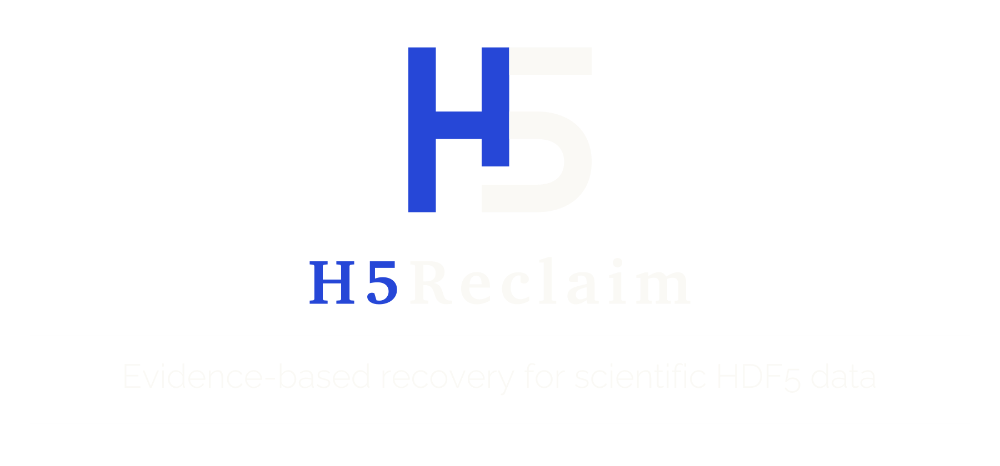

<p align="center">
  
</p>

<p align="center">
  <a href="pyproject.toml"></a>
  <a href="LICENSE"></a>
  <a href="docs/coverage.md"></a>
</p>

<p align="center">
  <strong>اللغات:</strong>
  <a href="README.md" lang="en">English</a> · <a href="README.pl.md" lang="pl">Polski</a> · <a href="README.de.md" lang="de">Deutsch</a> · <a href="README.fr.md" lang="fr">Français</a> · <a href="README.es.md" lang="es">Español</a> · <a href="README.pt-BR.md" lang="pt-BR">Português (Brasil)</a><br>
  <a href="README.zh-CN.md" lang="zh-CN">简体中文</a> · <a href="README.ja.md" lang="ja">日本語</a> · <a href="README.ko.md" lang="ko">한국어</a> · <a href="README.ru.md" lang="ru">Русский</a> · <a href="README.ar.md" lang="ar">العربية</a>
</p>

<!-- English README SHA-256: 5a2c704dd8e97c5bb668d1c2f9e856b9e21568e44477487b74e281f694a66646 -->

يستعيد H5Reclaim البيانات العلمية من ملفات HDF5 التالفة. وينقل القياسات التي بقيت سليمة إلى ملف جديد قابل للاستخدام بعد انقطاع الكتابة، أو تلف الفهارس والبيانات الوصفية، أو اقتطاع الملف. وHDF5 هو تنسيق تستخدمه أجهزة وتطبيقات علمية كثيرة لتخزين المصفوفات والقياسات والبيانات الوصفية المرتبطة بها.

**بأمر واحد، يكتشف مجموعات البيانات، ويختار طرائق الاستعادة، وينشئ ملف HDF5 جديدًا مع تقرير JSON واضح.** يبقى الملف الأصلي دون تغيير. ويحتفظ H5Reclaim بالقياسات القابلة للقراءة من مجموعات البيانات المتضررة جزئيًا، ثم يواصل استعادة بقية الملف.

حقق الإصدار المرشح 1.0.0rc1 **استعادة مفيدة بنسبة 95.4% في 109 تجارب مضبوطة على ملفات تالفة**: 77 حالة استعادة كاملة ودقيقة، و27 حالة استعادة جزئية، دون أي قيم خاطئة مقبولة في هذه المجموعة التجريبية. تقيس هذه التجارب المُولَّدة أنواع التلف المحددة فيها، ولا تمثل نسبة نجاح متوقعة لملفات أخرى. [اطّلع على النتائج](docs/coverage.md).

[البدء السريع](#quick-start) · [دليل الاستخدام](docs/usage.md) · [نطاق الاستعادة](docs/coverage.md) · [صيغة التقرير](docs/report-schema.md) · [ملاحظات الإصدار](CHANGELOG.md)

<a id="quick-start"></a>
## البدء السريع

تحتاج إلى Python 3.10 أو إصدار أحدث. استنسخ هذا المستودع، أو نزّل ملف ZIP الخاص به من GitHub وفك ضغطه:

```sh
git clone https://github.com/xShadyy/H5Reclaim.git
cd H5Reclaim
python -m venv .venv
```

فعّل البيئة الافتراضية:

| النظام | الأمر |
| --- | --- |
| Windows PowerShell | `.venv\Scripts\Activate.ps1` |
| Windows Command Prompt | `.venv\Scripts\activate.bat` |
| macOS / Linux | `. .venv/bin/activate` |

ثبّت الأداة من جذر المستودع واستعد أحد الملفات:

```sh
python -m pip install .
python -m h5reclaim rescue "damaged.h5"
```

ينشئ ذلك الملفين `damaged.recovered.h5` و`damaged.recovered.report.json` بجانب الملف المصدر. ولا يُستبدل أي ملف موجود في وجهة الإخراج. حدّد المسارات صراحةً لاختيار موقع آخر أو لإعادة التشغيل:

```sh
python -m h5reclaim rescue "damaged.h5" --output "rescued.h5" --report "evidence.json"
```

يمكنك أيضًا استخدام الأمر `h5reclaim` بعد التثبيت. شغّل `python -m h5reclaim --help` لعرض الأوامر، أو `python -m h5reclaim rescue --help` لعرض خيارات الاستعادة.

## فهم النتائج

يعرض ملخص الطرفية ما إذا كانت الاستعادة كاملة أو جزئية، ويذكر مواقع ملفات الإخراج. ويحدد تقرير JSON مجموعات البيانات المستعادة، وطرائق الاستعادة، والمواضع التي لم تُستعد، والبيانات الوصفية التي أُعيدت.

تحقق من تطابق المخرجات المنشورة مع التقرير المحفوظ قبل استخدامها:

```sh
python -m h5reclaim verify-result "damaged.recovered.h5" "damaged.recovered.report.json" --source "damaged.h5"
```

يفحص ذلك اتساق التقرير، وشكل مجموعة البيانات، وبصمة الملف المصدر، وخريطة الصلاحية داخل عامل بحدود موارد. ولا يقرأ قيم القياسات المستعادة أو يتحقق من صحتها؛ أما مسارات الاستعادة التي لا توفر خريطة قابلة للفحص فتعيد نتيجة تفيد بعدم الدعم. راجع [دليل الاستخدام](docs/usage.md#verify-a-published-result) لمعرفة رموز الخروج والحدود.

عندما ينشر مسار الاستعادة **خريطة حالة**، فإنها تبيّن المواضع التي تحتوي على قياسات مقبولة. استخدم الخريطة المذكورة في التقرير لاختيار القيم التي ستدخل في التحليل؛ فقد تُعرض قيمة ملء مثل الصفر في المواضع غير المعروفة. بعض مجموعات البيانات المتصلة والسليمة، ومجموعات البيانات الفارغة من النوع null، لا تملك خريطة قابلة للفحص؛ لذلك راجع التقرير الخاص بمسار استعادتها قبل التحليل. وتضيف النسخ المرجعية السابقة وحزم الحماية إمكانية المقارنة مع لقطة محفوظة من وقت أسبق.

في مجموعات البيانات ثابتة الحجم، يمكنك قراءة القيم المستعادة مع حجب المواضع غير المعروفة مسبقًا:

```python
from h5reclaim import read_masked

values = read_masked(
    "damaged.recovered.h5", "damaged.recovered.report.json",
    "/experiment/readings", selection=(slice(0, 1000), Ellipsis),
)
```

تستخدم هذه القراءة المحدودة الموارد خريطة الحالة المذكورة لمجموعة البيانات في التقرير. يحدد القناع القيم المقبولة من المدخل التالف؛ ولا يثبت تطابقها مع لقطة محفوظة من وقت أسبق. راجع [دليل الاستخدام](docs/usage.md#read-results) لمعرفة خيارات التحديد المدعومة وحدودها.

## إجراءات شائعة

| الهدف | الأمر |
| --- | --- |
| فحص ملف قبل الاستعادة | `python -m h5reclaim diagnose damaged.h5` |
| استعادة مجموعة بيانات واحدة | `python -m h5reclaim rescue damaged.h5 --dataset /experiment/readings` |
| تلخيص نتيجة موجودة | `python -m h5reclaim report damaged.recovered.report.json` |
| فحص اتساق المخرجات والتقرير | `python -m h5reclaim verify-result damaged.recovered.h5 damaged.recovered.report.json` |
| استئناف استعادة طويلة | `python -m h5reclaim rescue damaged.h5 --resume-dir recovery-progress` |
| توفير الملفات المرافقة | `python -m h5reclaim rescue container.h5 --related-dir companion-files` |
| العثور على مجموعات بيانات بعد فقد أسمائها | `python -m h5reclaim discover damaged.h5 --json` |

تحتاج بعض الملفات إلى برامج ترميز إضافية للضغط. شغّل `python -m pip install ".[filters]"` من جذر المستودع، ثم أعد المحاولة. يتناول [دليل الاستخدام](docs/usage.md) الملفات الكبيرة، وحدود الموارد، والملفات التابعة، وعمليات الاستعادة القابلة للاستئناف، وحزم الحماية السابقة.

## نطاق الاستعادة

يقرأ H5Reclaim أوصاف مجموعات البيانات من كل ملف نفسه، لذا يمكن اتباع الإجراء نفسه عبر تجارب مختلفة وأسماء متنوعة لمجموعات البيانات وأشكال متعددة للمصفوفات.

| المجال | النطاق المُنفَّذ |
| --- | --- |
| التخزين | مجموعات بيانات compact وcontiguous وchunked؛ فهارس أجزاء قديمة وحديثة |
| القيم | مصفوفات رقمية، وسجلات مركبة، وسلاسل نصية ثابتة ومتغيرة الطول، ومصفوفات متفاوتة الطول، وتعدادات، ومراجع، ومجموعات بيانات خالية أو من النوع null |
| التلف | استعادة روابط الفهارس المكسورة، وتصحيح البيانات الوصفية وأبعاد الأجزاء حين تبرره المجاميع الاختبارية، وإصلاح التواقيع الحديثة، وعلامات انقطاع الكتابة، ورؤوس مجموعات البيانات الباقية، والأجزاء غير القابلة للقراءة، والاقتطاع الفعلي لنهاية الملف |
| الضغط | DEFLATE وLZF وshuffle وFletcher32 وبرامج الترميز الاختيارية المدعومة والمضمّنة |
| بنية الملف | المجموعات المتاحة، والسمات، والروابط، وأنواع البيانات المسماة، والمراجع، ومقاييس الأبعاد، وترويسات التطبيقات |
| التبعيات | التخزين الخارجي، ومجموعات البيانات الافتراضية، والروابط الخارجية، وملفات Family/Split مع ملفات مرافقة أو قوائم ملفات تُقدَّم صراحةً |

بالنسبة إلى البيانات التي حُميت قبل تلفها، يمكن أيضًا إعادة بناء البيانات المفقودة من النسخ المتماثلة المحفوظة وبيانات التكافؤ. ويدعم اكتشاف الملفات المرافقة، والاستعادة القابلة للاستئناف، وحدود الموارد أثناء التدفق، سير العمل العلمي الأكبر حجمًا.

يغطي **معيار الاستعادة التلقائية للإصدار 1.0.0rc1** 23 عائلة من البيانات وتخطيطات التخزين المُولَّدة. وأسفرت **109 تجارب مضبوطة على ملفات تالفة** عن 77 استعادة كاملة ودقيقة، و27 استعادة جزئية، و5 حالات رفض: **104 مخرجات مفيدة (95.4%)**. واستعاد 83.1% من عناصر الأصل في إحداثياتها الدقيقة، دون أي قيم خاطئة مقبولة ودون تغيير أي ملف مصدر. وأنتجت جميع حالات تلف أبعاد الأجزاء المحددة، وعددها 15، مخرجات مفيدة، بما في ذلك مصفوفات بخمسة أبعاد، وscale-offset، وسلاسل نصية متغيرة الطول، ومصفوفات متفاوتة الطول، وحقول متغيرة الطول داخل سجلات مركبة. [اقرأ تقرير الحالات الكامل](benchmarks/results/v100rc1-release-coverage.json) أو [تفصيل نطاق الاستعادة](docs/coverage.md).

تشمل تقييمات v0.14.0 المسجلة ما يلي:

| التقييم | النتيجة المسجلة |
| --- | --- |
| [أربعة ملفات علمية سليمة](benchmarks/results/v014-scientific-whole.json) | تطابقت 251 مجموعة بيانات و253 سمة تمامًا مع النسخ الأصلية المحفوظة |
| [رابط فهرس GWOSC مكسور في اختبار مضبوط](benchmarks/results/v014-gwosc-controlled.json) | استُعيد 128/128 جزءًا في إحداثياتها الدقيقة؛ صفر أجزاء خاطئة |
| [MATLAB 7.3 وnetCDF4 وNWB](benchmarks/results/v014-application-readers.json) | فتحت أدوات قراءة مستقلة ستة مخرجات سليمة أو ذات تلف مضبوط؛ صفر عناصر خاطئة مقبولة، مع إبقاء المناطق التالفة غير معروفة |

يوضح [دليل المعايير](benchmarks/README.md) كيفية إعادة إجراء التقييمات. وتقدم [ملاحظات مجموعة الملفات](corpus/README.md) معلومات نسب الملفات العلمية إلى مصادرها.

## المساهمة والإبلاغ عن المشكلات

افتح [بلاغًا](https://github.com/xShadyy/H5Reclaim/issues) يتضمن الأمر المستخدم، وإصداري الأداة وPython، والخطأ الذي ظهر، والنتيجة المتوقعة. يساعد ملف صغير يمكن إعادة إنتاج المشكلة به وتقريره على التمييز بين نوع تخزين غير مدعوم وخطأ في الاستعادة.

للإبلاغ عن ثغرة أمنية، اتبع [سياسة الإبلاغ الأمني](SECURITY.md)؛ وافحص التقارير بحثًا عن مسارات وبيانات وصفية حساسة قبل مشاركتها.

للتطوير، ثبّت الأداة باستخدام `python -m pip install -e ".[filters]"` ثم شغّل:

```sh
python -m unittest discover -s tests -q
```

تفحص الاختبارات صحة الاستعادة، والمحافظة على الملف المصدر، والتعامل مع البيانات التي لم تُستعد. وتقيس المعايير القيم المقبولة بمقارنتها مع أصول منفصلة. يوضح [دليل المستودع](docs/file-guide.md) مواضع ملفات التنفيذ وأسباب وجودها.
ويسجل [دليل الإصدار](docs/releasing.md) بناء الإصدار المرشح، وفحص الوسم، والتحققات المتبقية قبل الإصدار المستقر 1.0.

## الترخيص

تتوفر الشفرة المصدرية بموجب [رخصة Apache 2.0](LICENSE). وللملفات العلمية المضمّنة [نسب إلى مصادرها وتراخيص منفصلة](corpus/README.md).

<sub>أنشأه Tymoteusz Netter.</sub>
